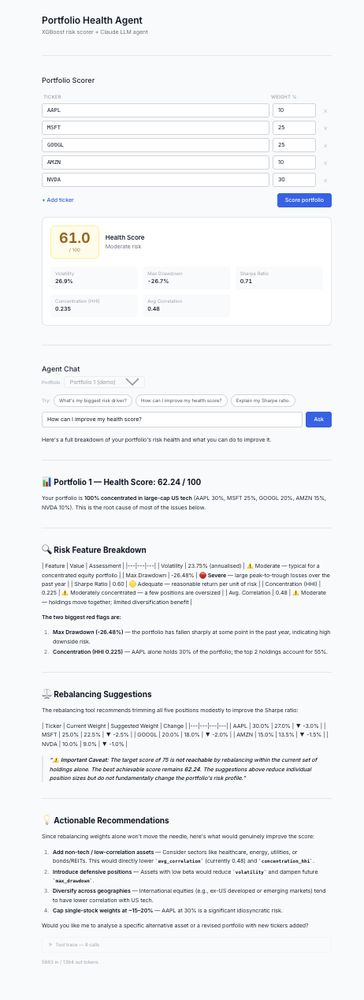

# Portfolio Health Score Agent

**Live:** https://portfolio-health-agent.vercel.app
**API:** https://portfolio-health-agent-production.up.railway.app

An XGBoost model that scores portfolios **0–100** from time-series risk features,
wrapped by an LLM agent (Claude) that can answer questions, explain risk drivers,
and suggest rebalancing actions.



---

## Try it

**Score a portfolio** (no auth required):

```bash
curl -X POST https://portfolio-health-agent-production.up.railway.app/scores/score \
  -H "Content-Type: application/json" \
  -d '{"weights": {"AAPL":0.30,"MSFT":0.25,"GOOGL":0.20,"AMZN":0.15,"NVDA":0.10}}'
```

Or open the [frontend](https://portfolio-health-agent.vercel.app), enter your weights, and ask the agent questions like:
- "What's my biggest risk driver?"
- "How can I improve my health score?"
- "Explain my Sharpe ratio."

---

## Tech Stack

| Layer | Technology |
|---|---|
| **Backend** | Python, FastAPI, Uvicorn |
| **ML** | XGBoost, yfinance, Pandas, NumPy |
| **Database** | PostgreSQL, SQLAlchemy (async), Alembic |
| **LLM / Agent** | Anthropic API (Claude), LLM tool calling |
| **Frontend** | Next.js 14, React, Tailwind CSS, react-markdown |
| **Infra** | Docker (multi-stage), Railway (API + Postgres), Vercel (frontend) |
| **Observability** | Prometheus, Grafana, PSI drift detection |
| **CI/CD** | GitHub Actions — two-tier LLM-as-judge eval harness, smoke on PR / full on merge |

---

## Milestones

### M1 — Data + Model
- PostgreSQL schema (portfolios, holdings, prices) + Alembic migrations
- yfinance price ingestion script
- Feature engineering: volatility, max drawdown, Sharpe, HHI concentration, avg correlation
- XGBoost trained on synthetic labelled portfolios; `MAE < 1.0`, `R² > 0.99`
- `/scores/score` REST endpoint; unit tests for all feature functions

### M2 — LLM Agent + Tools
- Anthropic tool-use agentic loop with max-turns guard
- Four tools: `get_health_score`, `query_holdings`, `explain_feature`, `suggest_rebalance`
- `/agent/chat` endpoint with token usage tracking
- Integration tests with fully mocked Anthropic client (no API key in unit CI)

### M3 — Eval Harness
- 31-case golden Q&A set covering scoring, explanation, rebalancing, edge cases
- LLM-as-judge faithfulness + completeness scoring (Claude grades Claude)
- Tool-use correctness assertions (right tool, right inputs)
- CI step gates on ≥85% pass rate + 100% tool correctness

### M4 — Deploy + Monitor
- Multi-stage Dockerfile (builder → dev → prod); prod is default build target
- Two-tier eval in CI: smoke (5 cases, ~2 min) on every PR; full (31 cases) on merge to main
- Railway deployment — full eval gates every merge; auto-deploy via Railway CLI
- Prometheus custom metrics: health score distribution, agent latency, token spend, PSI drift
- Grafana dashboard + Grafana Agent remote-write to Grafana Cloud
- PSI drift detection job (`scripts/check_drift.py`) with `drift_runs` table

### M5 — Frontend
- Next.js 14 + Tailwind 3 frontend deployed on Vercel
- Portfolio scorer: dynamic ticker/weight rows, client-side validation, score card with risk band
- Agent chat: example prompt chips, `react-markdown` rendering, collapsible tool trace, token usage footnote
- FastAPI CORS middleware (`FRONTEND_URL` env var); `vercel.json` configured for monorepo

---

## Architecture

```
                ┌──────────────────────────────────────────────────┐
                │                  FastAPI (Railway)                │
                │                                                  │
  User ──────►  │  /agent/chat  ──►  LLM Agent (Claude)           │
                │                        │                         │
                │               ┌────────┼──────────────┐          │
                │               ▼        ▼              ▼          │
                │      get_health_score  query_holdings  suggest_rebalance
                │               │        │              │          │
                │               ▼        ▼              ▼          │
                │         XGBoost    Postgres        XGBoost       │
                │         Scorer     (holdings)      Scorer        │
                │               │                                  │
                │               ▼                                  │
                │         yfinance (price fetch)                   │
                └──────────────────────────────────────────────────┘
                         │                    │
                    Prometheus            Postgres
                    /metrics              (scores, prices)
```

### Risk features (XGBoost inputs)

| Feature | Description |
|---|---|
| `volatility` | Annualised std dev of portfolio daily returns |
| `max_drawdown` | Peak-to-trough drawdown over lookback window |
| `sharpe` | Annualised Sharpe ratio (rf = 5%) |
| `concentration_hhi` | Herfindahl-Hirschman Index of weights |
| `avg_correlation` | Mean pairwise Pearson correlation of holdings |

### LLM Agent tools

| Tool | Purpose |
|---|---|
| `get_health_score` | Score a portfolio 0–100 + return features |
| `query_holdings` | Fetch current ticker/weight breakdown from Postgres |
| `explain_feature` | NL explanation of a feature value vs benchmarks |
| `suggest_rebalance` | Weight adjustments to hit a target score |

---

## Quick Start (local)

```bash
# 1. Install deps
pip install -e ".[dev]"

# 2. Copy env
cp .env.example .env   # fill in ANTHROPIC_API_KEY and DATABASE_URL

# 3. Start Postgres
docker-compose up db -d

# 4. Run migrations + seed
alembic upgrade head
python -m scripts.seed_ci_data

# 5. Train the model
python -m src.ml.train

# 6. Run tests
pytest tests/unit/ -q

# 7. Start API
uvicorn src.api.main:app --reload --port 8080
```

Or with full Docker Compose:
```bash
docker-compose up --build
```

---

## Deploying to Railway

### First-time setup (Railway dashboard)

1. New project → **Deploy from GitHub repo** → select this repo
2. Dockerfile is auto-detected; prod is the last (default) stage — no target needed
3. Add a **PostgreSQL** database service to the project
4. Set these environment variables on the API service:

| Variable | Value |
|----------|-------|
| `APP_ENV` | `production` |
| `ANTHROPIC_API_KEY` | `sk-ant-...` |
| `ANTHROPIC_MODEL` | `claude-sonnet-4-6` |
| `DATABASE_URL` | Copy Railway's injected Postgres URL, change `postgresql://` → `postgresql+asyncpg://` |
| `FRONTEND_URL` | Your Vercel deployment URL (for CORS) |

5. After first deploy, seed the production database:
```bash
railway run python -m scripts.seed_ci_data
```

### CI/CD

Merges to `main` run the full eval (31 cases, ≥85% pass rate + 100% tool correctness). If the gate passes, the workflow deploys automatically via the Railway CLI.

Add these secrets in repo **Settings → Secrets and variables → Actions**:

| Secret | Where to find it |
|--------|-----------------|
| `RAILWAY_TOKEN` | Railway dashboard → Account settings → Tokens |
| `RAILWAY_PROJECT_ID` | Railway project → Settings → General → Project ID |
| `RAILWAY_SERVICE_ID` | Railway API service → Settings → Service ID |
| `ANTHROPIC_API_KEY` | Used by the eval job in CI |

### Updating the model

Retrain locally, commit the new `models/` artifacts, open a PR. The smoke eval gates the PR; the full eval + Railway deploy run on merge.

> **Future:** move artifacts to S3/GCS with `MODEL_VERSION` pinning so model and code deploy independently. See `NOTES.md`.

---

## Project Structure

```
src/
  config.py              # Pydantic settings
  api/
    main.py              # FastAPI app
    routers/             # health, portfolios, scores, agent
  db/
    models.py            # SQLAlchemy ORM
    session.py           # Async session factory
  ml/
    features.py          # Risk feature computation
    train.py             # XGBoost training script
    predict.py           # Inference wrapper
  agent/
    tools.py             # Tool schemas + dispatch
    agent.py             # Agentic loop
  monitoring/
    prometheus.py        # Custom Prometheus metrics
    metrics.py           # PSI, score drift helpers
tests/
  unit/                  # Fast, no-network tests
  integration/           # DB + API tests (mocked Anthropic)
  eval/
    golden_qa.json        # LLM eval golden set
    judge.py              # LLM-as-judge scorer
    harness.py            # Eval runner + summary
scripts/
  seed_ci_data.py        # Seed portfolio + holdings
  ingest_prices.py       # yfinance price ingestion
  check_drift.py         # PSI drift detection job
  run_eval.py            # Two-tier eval runner
models/                  # Trained model artifacts (health_scorer.ubj, feature_baseline.parquet)
monitoring/
  grafana/dashboard.json # Grafana dashboard definition
  grafana-agent.yaml     # Grafana Agent scrape config
```
